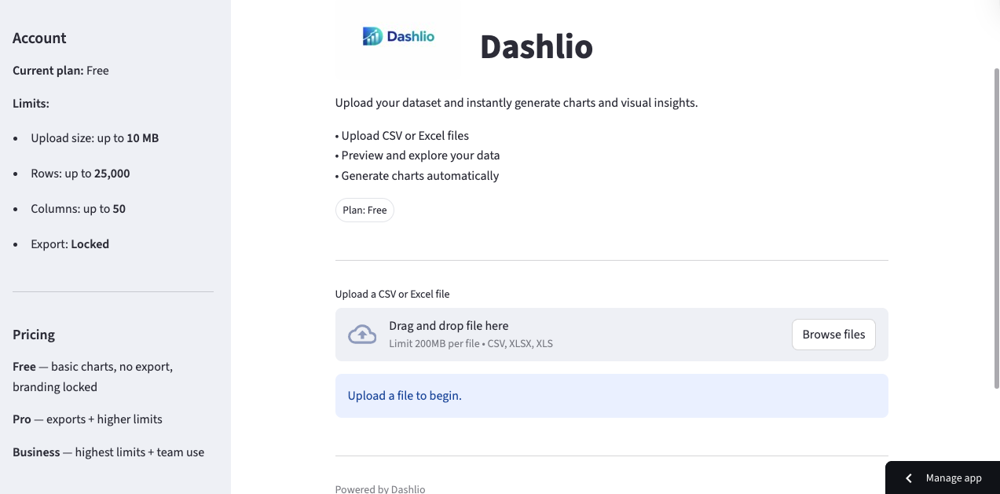

# Dashlio

Dashlio is a lightweight cloud data dashboard builder.

Users can upload datasets and instantly generate charts and visual insights.

## Live Demo

https://dashlio.streamlit.app

## Features

- Upload CSV or Excel files
- Preview and explore your data
- Generate charts automatically
- Simple and clean interface

## Tech Stack

- Python
- Streamlit
- Pandas
- Plotly
- GitHub

## Dashboard Preview

## Dashboard Preview

## Author

Devon Wildman  
Founder – SmartDash Analytics Ltd
